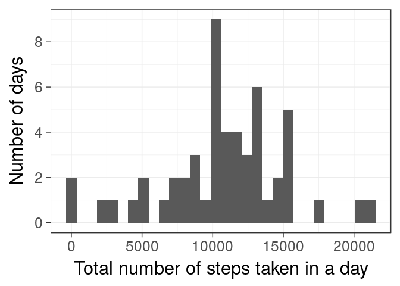
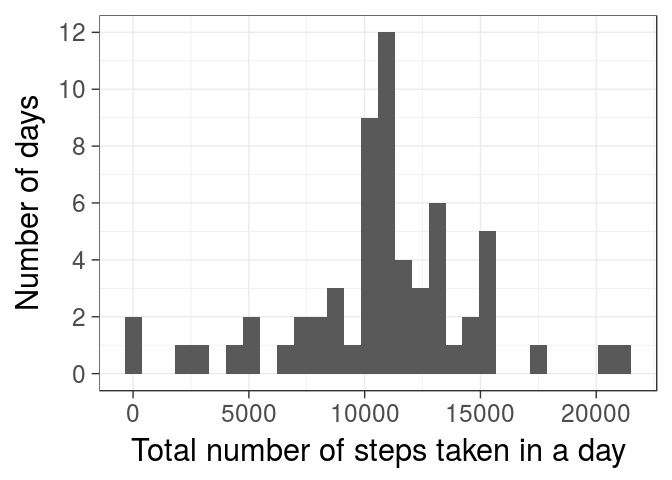
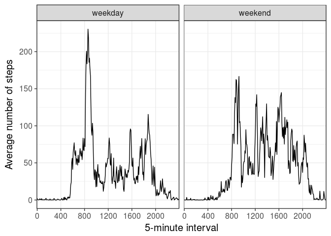

```r
#First of all, we load the tidyverse collection of packages
library(tidyverse)
```


## Loading and preprocessing the data

### 1. Load the data
As the data are compressed as a zip file, first we have to unzip it. Then we
can load the data into the object activity. The column interval is transformed 
into a factor while loading during the readr package. No more preprocessing is needed.


```r
unzip("activity.zip")
activity <- readr::read_csv("activity.csv",
                col_types =  cols(interval = col_factor(levels = NULL))
            )
```
  

## What is mean total number of steps taken per day?

### 1. Make a histogram of the total number of steps taken each day
First, we need to summarise the number of steps grouped by each day, the we can make a quick histogram with the default binwidth.


```r
total_steps_day <- activity %>% 
  group_by(date) %>% 
  summarise(total_steps_day=sum(steps)) 
total_steps_day %>%  
  ggplot() + 
    geom_histogram(aes(x=total_steps_day)) +
    theme_bw(base_size = 23) + 
    scale_y_continuous(breaks = seq(0, 10, by = 2)) +
    labs(x="Total number of steps taken in a day", y="Number of days") 
```

<!-- -->
 
### 2. Calculate and report the mean and median total number of steps taken per day
   
Here, I've just summarized the total steps each day by their mean and median, and then show the in a table

```r
total_steps_day %>%
  summarise(mean = mean(total_steps_day, na.rm = T),
                   median = median(total_steps_day, na.rm = T)) %>%
  knitr::kable(caption="Mean and Median of the number of steps per day")
```


Table: Mean and Median of the number of steps per day

     mean   median
---------  -------
 10766.19    10765
  
## What is the average daily activity pattern?

### 1. Make a time series plot (i.e. type = "l") of the 5-minute interval (x-axis) and the average number of steps taken, averaged across all days (y-axis)

First, I need to compute the interval averaged number of steps, then we can plot it.


```r
steps_interval <- activity %>% 
  group_by(interval) %>% 
  summarise(avg_steps_taken = mean(steps, na.rm = TRUE))
steps_interval %>%  
  ggplot() + 
    geom_line(aes(x=interval,y=avg_steps_taken, group=1)) +
    scale_x_discrete(breaks=seq(0,2300,by=200)) +
    theme_bw(base_size = 15) + 
    labs(x="5-minute interval", y="Average number of steps")
```

<!-- -->


### 2. Which 5-minute interval, on average across all the days in the dataset, contains the maximum number of steps?


```r
steps_interval %>% 
  filter(avg_steps_taken == max(avg_steps_taken)) %>%
   knitr::kable(caption="Interval ID with the larger number of steps on 
                average across all the days and such a number")
```


Table: Interval ID with the larger number of steps on 
                average across all the days and such a number

interval    avg_steps_taken
---------  ----------------
835                206.1698

## Imputing missing values
  
### 1. Calculate and report the total number of missing values in the dataset (i.e. the total number of rows with NAs)


```r
activity %>% 
  filter(is.na(steps)) %>% count() %>%
  knitr::kable(caption="Number of missing values in the dataset")
```


|    n|
|----:|
| 2304|
  
### 2. Devise a strategy for filling in all of the missing values in the dataset. The strategy does not need to be sophisticated. For example, you could use the mean/median for that day, or the mean for that 5-minute interval, etc.

Given that we already have the average steps in each 5-minute interval, this would be the value to fill the NAs.

### 3. Create a new dataset that is equal to the original dataset but with the missing data filled in.


```r
activity_fixed <- activity %>% 
  left_join(steps_interval, by="interval") %>%
  mutate(steps=ifelse(is.na(steps),avg_steps_taken,steps)) %>%
  select(-avg_steps_taken)
activity_fixed
```

```
## # A tibble: 17,568 x 3
##     steps date       interval
##     <dbl> <date>     <fct>   
##  1 1.72   2012-10-01 0       
##  2 0.340  2012-10-01 5       
##  3 0.132  2012-10-01 10      
##  4 0.151  2012-10-01 15      
##  5 0.0755 2012-10-01 20      
##  6 2.09   2012-10-01 25      
##  7 0.528  2012-10-01 30      
##  8 0.868  2012-10-01 35      
##  9 0      2012-10-01 40      
## 10 1.47   2012-10-01 45      
## # ... with 17,558 more rows
```

### 4. Make a histogram of the total number of steps taken each day and Calculate and report the mean and median total number of steps taken per day. Do these values differ from the estimates from the first part of the assignment? What is the impact of imputing missing data on the estimates of the total daily number of steps?


```r
total_steps_day_fixed <- activity_fixed %>% 
  group_by(date) %>% 
  summarise(total_steps_day=sum(steps)) 
total_steps_day_fixed %>% 
  ggplot() +
    geom_histogram(aes(x=total_steps_day)) +
    theme_bw(base_size = 23) + 
    scale_y_continuous(breaks = seq(0, 14, by = 2)) +
    labs(x="Total number of steps taken in a day", y="Number of days") 
```

<!-- -->


```r
left_join(total_steps_day,total_steps_day_fixed,by="date", suffix = c("_original","_fixed")) %>% select(-date) %>% summarise_all(c("mean", "median"), na.rm=T) %>% t
```

```
##                                     [,1]
## total_steps_day_original_mean   10766.19
## total_steps_day_fixed_mean      10766.19
## total_steps_day_original_median 10765.00
## total_steps_day_fixed_median    10766.19
```

Mean doesn't change at all, and only median has incresed a bit after fixing the missing values.

## Are there differences in activity patterns between weekdays and weekends?

### Create a new factor variable in the dataset with two levels – “weekday” and “weekend” indicating whether a given date is a weekday or weekend day.


```r
activity_week <- activity_fixed %>% 
  mutate(weekday=weekdays(date,T), 
         type_day = factor(
           ifelse(is.element(weekday,c("Sat","Sun")),"weekend","weekday")
           )) 
```

### Make a panel plot containing a time series plot (i.e. type = "l") of the 5-minute interval (x-axis) and the average number of steps taken, averaged across all weekday days or weekend days (y-axis). The plot should look something like the following, which was creating using simulated data:

First activity data are filtered by weekday or weekend


```r
steps_interval_week <- activity_week %>% 
  group_by(interval, type_day) %>% 
  summarise(avg_steps_taken = mean(steps, na.rm = TRUE)) 
steps_interval_week %>%
  ggplot() +
    geom_line(aes(x=interval,y=avg_steps_taken, group=1)) +
    scale_x_discrete(breaks=seq(0,2300,by=400)) +
    facet_wrap(~type_day) +
    theme_bw(base_size = 15) + 
    labs(x="5-minute interval", y="Average number of steps")
```

<!-- -->

### SessionInfo

```r
sessionInfo()
```

```
## R version 3.4.3 (2017-11-30)
## Platform: x86_64-pc-linux-gnu (64-bit)
## Running under: Ubuntu 16.04.3 LTS
## 
## Matrix products: default
## BLAS: /usr/lib/openblas-base/libblas.so.3
## LAPACK: /usr/lib/libopenblasp-r0.2.18.so
## 
## locale:
##  [1] LC_CTYPE=en_US.UTF-8       LC_NUMERIC=C              
##  [3] LC_TIME=en_IE.UTF-8        LC_COLLATE=en_US.UTF-8    
##  [5] LC_MONETARY=en_IE.UTF-8    LC_MESSAGES=en_US.UTF-8   
##  [7] LC_PAPER=en_IE.UTF-8       LC_NAME=C                 
##  [9] LC_ADDRESS=C               LC_TELEPHONE=C            
## [11] LC_MEASUREMENT=en_IE.UTF-8 LC_IDENTIFICATION=C       
## 
## attached base packages:
## [1] stats     graphics  grDevices utils     datasets  methods   base     
## 
## other attached packages:
## [1] bindrcpp_0.2    dplyr_0.7.4     purrr_0.2.2.2   readr_1.1.1    
## [5] tidyr_0.6.3     tibble_1.4.2    ggplot2_2.2.1   tidyverse_1.1.1
## 
## loaded via a namespace (and not attached):
##  [1] Rcpp_0.12.15     highr_0.6        cellranger_1.1.0 pillar_1.1.0    
##  [5] compiler_3.4.3   plyr_1.8.4       bindr_0.1        forcats_0.2.0   
##  [9] tools_3.4.3      digest_0.6.14    lubridate_1.6.0  jsonlite_1.5    
## [13] evaluate_0.10.1  nlme_3.1-131     gtable_0.2.0     lattice_0.20-35 
## [17] pkgconfig_2.0.1  rlang_0.1.6      psych_1.7.5      cli_1.0.0       
## [21] yaml_2.1.16      parallel_3.4.3   haven_1.0.0      xml2_1.1.1      
## [25] httr_1.3.1       stringr_1.2.0    knitr_1.17       hms_0.3         
## [29] rprojroot_1.3-1  grid_3.4.3       glue_1.2.0       R6_2.2.2        
## [33] readxl_1.0.0     foreign_0.8-69   rmarkdown_1.8    modelr_0.1.0    
## [37] reshape2_1.4.2   magrittr_1.5     backports_1.1.2  scales_0.4.1    
## [41] htmltools_0.3.6  rvest_0.3.2      assertthat_0.2.0 mnormt_1.5-5    
## [45] colorspace_1.3-2 labeling_0.3     utf8_1.1.3       stringi_1.1.5   
## [49] lazyeval_0.2.1   munsell_0.4.3    broom_0.4.2      crayon_1.3.4
```
